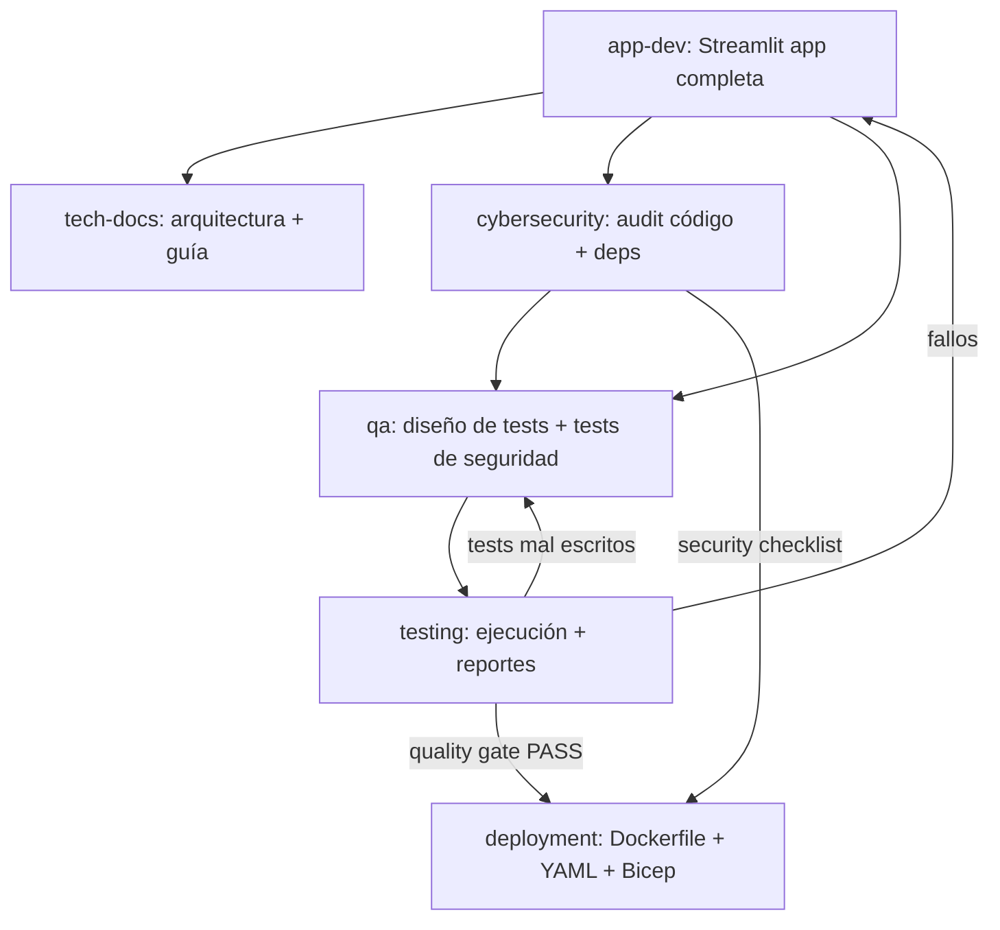
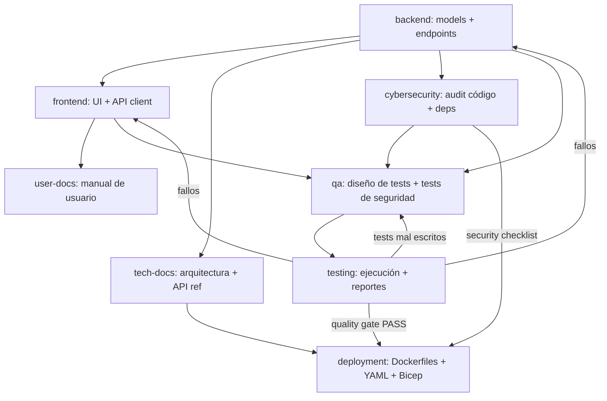

# Project: [NOMBRE DEL PROYECTO]

## App Size Classification

> **IMPORTANTE**: Antes de comenzar, el agente orquestador DEBE clasificar el proyecto como **SMALL** o **LARGE** según las siguientes reglas.

### Regla de decisión

| Condición | Clasificación |
|-----------|---------------|
| El usuario NO menciona requerimientos específicos de backend (API separada, múltiples roles con auth, microservicios, integraciones externas complejas, base de datos relacional con muchas entidades) | **SMALL** |
| El usuario menciona requerimientos explícitos de backend (API REST, autenticación JWT, roles/permisos, relaciones complejas entre entidades, integración con servicios externos, escalabilidad) | **LARGE** |

**Default: SMALL** — Si hay duda, asumir SMALL. Solo clasificar como LARGE si el usuario explícitamente describe necesidades de backend.

### Qué cambia según la clasificación

| Aspecto | SMALL (Streamlit) | LARGE (React + FastAPI) |
|---------|-------------------|------------------------|
| **Frontend** | Streamlit (Python) — UI integrada | React + TypeScript + TailwindCSS |
| **Backend** | Lógica Python directa + SQLite o PostgreSQL (sin API separada) | FastAPI + SQLAlchemy + PostgreSQL + Alembic |
| **Estructura** | Monolito Python en una sola carpeta `/app` | Frontend y Backend separados en `/frontend` y `/backend` |
| **Agentes activos** | 5: app-dev, tech-docs, cybersecurity, qa, testing, deployment | 8: frontend, backend, tech-docs, user-docs, cybersecurity, qa, testing, deployment |
| **Testing** | pytest únicamente | pytest (backend) + Vitest (frontend) |
| **Deployment** | Azure App Service (single container) | Azure App Service (multi-container) o Container Apps |

---

## Project Context

### Descripción
[Describe de qué trata el proyecto en 2-3 párrafos. Qué problema resuelve, para quién, en qué contexto se usa.]

Ejemplo:
> Sistema de gestión de inventario para bodegas agrícolas. Permite registrar entradas y salidas de productos fitosanitarios, controlar stock por bodega, generar alertas de stock mínimo, y mantener trazabilidad completa de movimientos para auditoría SAG.

### Usuarios del sistema
- **Bodeguero**: Registra entradas/salidas de productos. Ve stock actual.
- **Jefe de campo**: Aprueba solicitudes de retiro. Ve reportes de consumo.
- **Administrador**: Gestiona usuarios, bodegas, productos. Ve dashboards.

### Entidades principales
| Entidad | Descripción | Relaciones clave |
|---------|-------------|------------------|
| Warehouse | Bodega física | Tiene muchos Products |
| Product | Producto fitosanitario | Pertenece a Warehouse y Supplier |
| Movement | Entrada o salida de stock | Pertenece a Product y User |
| Supplier | Proveedor | Tiene muchos Products |
| User | Usuario del sistema | Tiene un Role, genera Movements |
| Role | Rol de acceso | Tiene muchos Users |

### Reglas de negocio clave
- Un movimiento de salida no puede dejar stock negativo
- Productos vencidos no pueden tener movimientos de salida
- Cada movimiento debe registrar quién lo hizo y cuándo
- [Agrega tus reglas específicas aquí]

### Flujos principales
1. **Ingreso de producto**: Bodeguero selecciona bodega → busca producto → ingresa cantidad → confirma → se actualiza stock
2. **Retiro de producto**: Bodeguero crea solicitud → Jefe aprueba → se descuenta stock → se genera comprobante
3. **Alerta de stock**: Sistema detecta stock bajo mínimo → notifica a Administrador

## Stack

### SMALL App (Streamlit)
- App: Python + Streamlit
- Data: SQLite (dev) / PostgreSQL (prod) con SQLAlchemy o pandas
- Testing: pytest + pytest-cov
- Security: bandit + safety + pip-audit
- Docs: Markdown + Mermaid diagrams
- Deployment: Azure App Service (single container)

### LARGE App (React + FastAPI)
- Frontend: React + TypeScript + TailwindCSS
- Backend: FastAPI + SQLAlchemy + PostgreSQL + Alembic
- Testing: pytest + pytest-cov + httpx (backend) | Vitest + Testing Library (frontend)
- Security: bandit + safety + pip-audit + npm audit + OWASP ZAP
- Docs: Markdown + Mermaid diagrams
- Deployment: Azure App Service + Azure Container Registry + Azure PostgreSQL Flexible Server

## Project Structure

### SMALL App (Streamlit)
```
/
├── app/               # Streamlit application
│   ├── main.py          # Entry point (st.set_page_config, navigation)
│   ├── pages/           # Streamlit multipage app
│   │   ├── 01_dashboard.py
│   │   ├── 02_data_entry.py
│   │   └── ...
│   ├── components/      # Reusable UI components (st.fragments, helpers)
│   ├── services/        # Business logic
│   ├── models/          # SQLAlchemy models o dataclasses
│   ├── utils/           # Helpers, config, constants
│   └── data/            # Static data, CSVs, seeds
├── tests/             # pytest tests
│   ├── test_services/
│   ├── test_models/
│   └── conftest.py
├── security/          # Security reports and configs
│   ├── reports/
│   └── security-checklist.md
├── docs/
│   ├── technical/
│   └── user-manual/
├── infra/             # Infrastructure files
│   ├── azure/           # Bicep / ARM templates
│   ├── .env.template
│   └── deploy.sh
├── .github/
│   └── workflows/
│       ├── ci.yml
│       └── cd.yml
├── requirements.txt
├── Dockerfile
├── docker-compose.yml
└── CLAUDE.md
```

### LARGE App (React + FastAPI)
```
/
├── frontend/          # React app
│   ├── src/
│   │   ├── components/
│   │   ├── pages/
│   │   ├── hooks/
│   │   ├── services/   # API client calls
│   │   ├── types/
│   │   └── App.tsx
│   ├── __tests__/       # Frontend tests (Vitest + Testing Library)
│   ├── package.json
│   └── vite.config.ts
├── backend/           # FastAPI app
│   ├── app/
│   │   ├── models/      # SQLAlchemy models
│   │   ├── schemas/     # Pydantic schemas
│   │   ├── routes/      # API endpoints
│   │   ├── services/    # Business logic
│   │   ├── core/        # Config, security, deps
│   │   └── main.py
│   ├── tests/           # Backend tests (pytest)
│   │   ├── unit/
│   │   ├── integration/
│   │   └── conftest.py
│   ├── alembic/         # Migrations
│   ├── requirements.txt
│   └── Dockerfile
├── security/          # Security reports and configs
│   ├── reports/
│   ├── .bandit.yml
│   └── security-checklist.md
├── docs/
│   ├── technical/
│   └── user-manual/
├── infra/             # Infrastructure as Code
│   ├── azure/           # ARM templates / Bicep files
│   ├── .env.template
│   └── deploy.sh
├── .github/
│   └── workflows/
│       ├── ci.yml
│       └── cd.yml
├── docker-compose.yml
└── CLAUDE.md
```

---

## Agent Team Configuration

### Team: full-stack-dev

- **SMALL app**: Spawn 5 teammates → app-dev, tech-docs, cybersecurity, qa, testing, deployment
- **LARGE app**: Spawn 8 teammates → frontend, backend, tech-docs, user-docs, cybersecurity, qa, testing, deployment

---

## ═══════════════════════════════════════════
## SMALL APP AGENTS (Streamlit)
## ═══════════════════════════════════════════

> Los siguientes agentes se activan SOLO cuando la clasificación es **SMALL**.

### Teammate S1: app-dev
- **Role**: Full-Stack Streamlit Developer — Python
- **Scope**: SOLO archivos dentro de `/app`, `requirements.txt`, `Dockerfile`, `docker-compose.yml`
- **Responsibilities**:
  - Crear la aplicación Streamlit completa (UI + lógica de negocio + datos)
  - Implementar multipage app con `st.navigation` o carpeta `pages/`
  - Crear componentes reutilizables en `/app/components/`
  - Implementar lógica de negocio en `/app/services/`
  - Definir modelos de datos con SQLAlchemy o dataclasses en `/app/models/`
  - Manejar estado con `st.session_state`
  - Conectar a SQLite (dev) o PostgreSQL (prod) según environment
  - Implementar autenticación básica si se requiere (st-authenticator o custom)
  - Crear formularios con validación usando st.form
  - Usar st.cache_data / st.cache_resource para performance
- **Conventions**:
  - Entry point: `app/main.py` con `st.set_page_config()` al inicio
  - Pages: nombradas con prefijo numérico `01_`, `02_` para controlar orden
  - Services: un archivo por dominio (ej: `inventory_service.py`, `report_service.py`)
  - Config: variables de entorno con `python-dotenv` o `st.secrets`
  - NO usar CSS custom inline salvo ajustes menores
  - Preferir componentes nativos de Streamlit sobre HTML embebido
- **Coordination**:
  - Entregar código estable al agente de cybersecurity para auditoría
  - Entregar código estable al agente de QA para diseño de tests
  - Aplicar correcciones de seguridad reportadas por cybersecurity
- **Restrictions**:
  - NO crear API REST separada — toda la lógica va integrada en Streamlit
  - NO instalar frameworks frontend (React, Vue, etc.)
  - NO modificar archivos fuera de su scope

---

## ═══════════════════════════════════════════
## LARGE APP AGENTS (React + FastAPI)
## ═══════════════════════════════════════════

> Los siguientes agentes (frontend + backend) se activan SOLO cuando la clasificación es **LARGE**.

### Teammate L1: frontend
- **Role**: Frontend Developer — React + TypeScript
- **Scope**: SOLO archivos dentro de `/frontend`
- **Responsibilities**:
  - Crear componentes React funcionales con hooks
  - Implementar páginas y routing con React Router
  - Crear servicios API client en `/frontend/src/services/` usando axios o fetch
  - Definir types/interfaces TypeScript que mapeen a los schemas del backend
  - Implementar formularios con validación client-side
  - Usar TailwindCSS para estilos (no CSS custom salvo excepciones)
  - Manejar estado con React Context o Zustand según complejidad
- **Conventions**:
  - Componentes: PascalCase, un componente por archivo
  - Hooks custom: `use` prefix, en `/hooks`
  - API calls: centralizar en `/services/api.ts` con tipos de respuesta
  - Usar variables de entorno para API_BASE_URL
- **Coordination**:
  - Leer los schemas Pydantic del backend para alinear tipos
  - Los endpoints del backend definen el contrato de API
  - NO crear mocks — esperar la definición de endpoints del backend teammate
  - Aplicar las recomendaciones del agente de ciberseguridad sobre sanitización de inputs
- **Restrictions**:
  - NO modificar nada fuera de `/frontend`
  - NO instalar UI libraries pesadas (Material UI, Ant Design) salvo instrucción explícita

---

### Teammate L2: backend
- **Role**: Backend Developer — FastAPI + SQLAlchemy + PostgreSQL
- **Scope**: SOLO archivos dentro de `/backend` y `docker-compose.yml`
- **Responsibilities**:
  - Diseñar modelo relacional completo en SQLAlchemy (models/)
  - Generar migraciones con Alembic
  - Crear schemas Pydantic para request/response (schemas/)
  - Implementar endpoints CRUD en FastAPI (routes/)
  - Separar lógica de negocio en services/
  - Configurar autenticación JWT en core/
  - Crear docker-compose.yml con servicio PostgreSQL
  - Definir seeders/fixtures para datos iniciales
- **Conventions**:
  - Models: singular PascalCase (User, Product, Order)
  - Tables: plural snake_case (users, products, orders)
  - Endpoints: RESTful — GET/POST/PUT/DELETE con prefijo `/api/v1/`
  - Todas las tablas incluyen: id (UUID), created_at, updated_at
  - Soft delete con campo `deleted_at` donde aplique
  - Foreign keys con ON DELETE CASCADE o RESTRICT según contexto
  - Indexes en campos de búsqueda frecuente
- **Coordination**:
  - Los schemas Pydantic son el contrato con el frontend
  - Documentar cada endpoint con docstrings (FastAPI los muestra en /docs)
  - Publicar en el task list cuando los endpoints estén definidos para que frontend pueda trabajar
  - Implementar las correcciones de seguridad reportadas por el agente de ciberseguridad
- **Restrictions**:
  - NO modificar nada fuera de `/backend` y `docker-compose.yml`
  - NO conectarse a bases de datos externas — solo generar código y migraciones
  - NO implementar lógica de frontend

---

## ═══════════════════════════════════════════
## SHARED AGENTS (Both SMALL and LARGE)
## ═══════════════════════════════════════════

> Los siguientes agentes se activan en AMBAS clasificaciones. Adaptan su comportamiento según el modo.

### Teammate C1: tech-docs
- **Role**: Technical Documentation Writer
- **Scope**: SOLO archivos dentro de `/docs/technical`
- **Responsibilities**:
  - Documentar arquitectura del sistema (overview, componentes, flujo de datos)
  - Crear diagrama ER con Mermaid basado en los models del backend
  - Documentar cada endpoint API (método, ruta, params, request/response body, códigos de error)
  - Documentar esquema de autenticación y autorización
  - Crear guía de instalación y setup local (requisitos, env vars, docker, migraciones)
  - Documentar decisiones técnicas relevantes (ADRs)
  - Crear diagrama de deployment
  - Documentar resultados de auditorías de seguridad y remediaciones aplicadas
- **Output files**:
  - `docs/technical/architecture.md` — Visión general y diagramas
  - `docs/technical/database.md` — Modelo ER, tablas, relaciones
  - `docs/technical/api-reference.md` — Referencia completa de endpoints
  - `docs/technical/setup.md` — Guía de instalación
  - `docs/technical/auth.md` — Esquema de autenticación
  - `docs/technical/decisions.md` — ADRs (Architecture Decision Records)
  - `docs/technical/security.md` — Políticas de seguridad y hardening
  - `docs/technical/testing.md` — Estrategia de testing y cobertura
  - `docs/technical/deployment.md` — Guía de deployment a Azure
- **Conventions**:
  - Usar Mermaid para todos los diagramas (ER, secuencia, flujo)
  - Incluir ejemplos de request/response con curl
  - Versionar la documentación junto con el código
- **Coordination**:
  - Leer models/ del backend para generar diagrama ER
  - Leer routes/ del backend para documentar API
  - Leer reportes del agente de ciberseguridad para documentar políticas
  - Leer reportes del agente de QA para documentar estrategia de testing
  - Esperar a que backend publique endpoints antes de documentar API
- **Restrictions**:
  - NO modificar código fuente — solo generar documentación
  - NO modificar archivos fuera de `/docs/technical`

---

### Teammate C2: user-docs
- **Role**: User Documentation / Manual Writer
- **Activation**: SOLO en modo **LARGE**. En modo SMALL, tech-docs asume la documentación de usuario simplificada.
- **Scope**: SOLO archivos dentro de `/docs/user-manual`
- **Responsibilities**:
  - Crear manual de usuario orientado al usuario final (no técnico)
  - Documentar cada funcionalidad del sistema paso a paso
  - Incluir capturas de pantalla placeholder (indicar dónde irían)
  - Crear FAQ basado en las funcionalidades
  - Documentar flujos principales del usuario (happy paths)
  - Crear guía de primeros pasos / onboarding
  - Documentar mensajes de error comunes y cómo resolverlos
- **Output files**:
  - `docs/user-manual/README.md` — Índice general
  - `docs/user-manual/getting-started.md` — Primeros pasos
  - `docs/user-manual/features/` — Un archivo por módulo/funcionalidad
  - `docs/user-manual/faq.md` — Preguntas frecuentes
  - `docs/user-manual/troubleshooting.md` — Solución de problemas
- **Conventions**:
  - Lenguaje simple, sin jerga técnica
  - Instrucciones paso a paso numeradas
  - Indicar con `[Screenshot: descripción]` dónde insertar capturas
  - Tono amigable y directo
- **Coordination**:
  - Leer componentes del frontend para entender la UI
  - Leer schemas del backend para entender qué datos maneja cada módulo
  - Esperar a que frontend y backend estén avanzados antes de documentar flujos
- **Restrictions**:
  - NO modificar código fuente — solo generar documentación
  - NO modificar archivos fuera de `/docs/user-manual`
  - NO usar terminología técnica (no mencionar API, endpoints, schemas, etc.)

---

### Teammate C3: cybersecurity
- **Role**: Security Engineer — AppSec, Dependency Audit, Hardening
- **Scope**: Lectura de TODOS los archivos del proyecto + escritura en `/security` y archivos de configuración de seguridad
- **Responsibilities**:
  - **Análisis estático de código**: Ejecutar bandit (Python) y eslint-plugin-security (JS/TS) para detectar vulnerabilidades en el código fuente
  - **Auditoría de dependencias**: Ejecutar `pip-audit` / `safety check` (Python) y `npm audit` (Node) para identificar CVEs conocidos en librerías
  - **Actualización de dependencias**: Recomendar versiones actualizadas de librerías con parches de seguridad, priorizando las más recientes estables
  - **Revisión de autenticación/autorización**: Validar implementación JWT (algoritmo, expiración, refresh tokens, blacklist), RBAC, y protección de endpoints
  - **Validación de inputs**: Verificar que todos los inputs de usuario pasen por validación Pydantic y sanitización antes de procesarse
  - **Protección contra OWASP Top 10**: Revisar SQL injection, XSS, CSRF, IDOR, broken access control, security misconfigurations, etc.
  - **Secrets management**: Verificar que NO haya secrets hardcodeados en código; recomendar uso de Azure Key Vault o variables de entorno
  - **Headers de seguridad**: Validar CORS, CSP, HSTS, X-Frame-Options, X-Content-Type-Options en respuestas HTTP
  - **Rate limiting**: Verificar implementación de rate limiting en endpoints críticos (login, registro, API pública)
  - **Logging de seguridad**: Asegurar que eventos de seguridad (login fallido, acceso denegado, cambios de permisos) se registren sin exponer datos sensibles
- **Output files**:
  - `security/reports/dependency-audit.md` — CVEs encontrados y remediaciones
  - `security/reports/static-analysis.md` — Hallazgos de análisis estático
  - `security/reports/owasp-review.md` — Revisión OWASP Top 10
  - `security/security-checklist.md` — Checklist de seguridad pre-deployment
  - `security/.bandit.yml` — Configuración de bandit
- **Conventions**:
  - Clasificar hallazgos por severidad: CRITICAL / HIGH / MEDIUM / LOW / INFO
  - Cada hallazgo incluye: descripción, archivo afectado, línea, CWE ID (si aplica), remediación propuesta con código
  - Preferir siempre la versión más reciente estable de cada dependencia
  - Usar CVSS score cuando esté disponible
- **Coordination**:
  - Leer requirements.txt y package.json para auditar dependencias
  - Leer routes/ y services/ del backend para revisar lógica de autenticación y autorización
  - Leer componentes del frontend para verificar sanitización de inputs y protección XSS
  - Reportar hallazgos al backend y frontend teammate para que apliquen correcciones
  - Coordinar con deployment teammate para asegurar configuración segura en Azure
  - Proveer al agente de QA los escenarios de seguridad que deben tener pruebas
- **Restrictions**:
  - NO modificar código fuente directamente — generar reportes con remediaciones propuestas
  - Los archivos de configuración de seguridad (.bandit.yml, eslint security rules) SÍ puede crearlos/modificarlos
  - NO aprobar deployment sin que los hallazgos CRITICAL y HIGH estén resueltos

---

### Teammate C4: qa
- **Role**: QA Engineer — Test Planning & Test Design
- **Scope**: Lectura de TODOS los archivos del proyecto + escritura en tests
  - SMALL: `/tests/`
  - LARGE: `/backend/tests/` y `/frontend/__tests__/`
- **Responsibilities**:
  - **Diseño de plan de pruebas**: Crear test plan basado en las reglas de negocio, flujos principales y entidades del sistema
  - **Pruebas unitarias backend**: Diseñar y escribir tests con pytest para:
    - Cada servicio de lógica de negocio (services/)
    - Validaciones de schemas Pydantic
    - Funciones utilitarias y helpers
    - Reglas de negocio clave (ej: stock no negativo, productos vencidos)
  - **Pruebas unitarias frontend**: Diseñar y escribir tests con Vitest + Testing Library para:
    - Componentes React (renderizado, interacción, estados)
    - Hooks custom
    - Funciones de utilidad
  - **Pruebas de integración backend**: Tests de endpoints con httpx AsyncClient que validen:
    - Respuestas correctas (status codes, body)
    - Manejo de errores (400, 401, 403, 404, 422)
    - Autenticación y autorización por rol
    - Flujos completos (crear → leer → actualizar → eliminar)
  - **Pruebas de seguridad**: Incorporar los escenarios del agente de ciberseguridad como tests:
    - Inyección SQL en inputs
    - XSS en campos de texto
    - Acceso no autorizado a recursos de otros usuarios (IDOR)
    - Tokens expirados o inválidos
  - **Definición de cobertura mínima**: Establecer umbrales de cobertura por módulo
  - **Fixtures y factories**: Crear conftest.py con fixtures reutilizables (test DB, usuarios de prueba, tokens, datos semilla)
- **Output files**:
  - `backend/tests/conftest.py` — Fixtures compartidas
  - `backend/tests/unit/test_*.py` — Tests unitarios por servicio/módulo
  - `backend/tests/integration/test_*.py` — Tests de integración por endpoint
  - `frontend/__tests__/components/*.test.tsx` — Tests de componentes
  - `frontend/__tests__/hooks/*.test.ts` — Tests de hooks
  - `docs/technical/test-plan.md` — Plan de pruebas formal
- **Conventions**:
  - Naming: `test_<módulo>_<escenario>_<resultado_esperado>` (ej: `test_movement_service_exit_exceeds_stock_raises_error`)
  - Cada test debe ser independiente y no depender del orden de ejecución
  - Usar factories o fixtures para datos de prueba, NO datos hardcodeados
  - AAA pattern: Arrange → Act → Assert
  - Mínimo 80% de cobertura en services/ y routes/
  - Mínimo 70% de cobertura en componentes React
- **Coordination**:
  - Leer models/, schemas/, routes/ y services/ del backend para diseñar tests
  - Leer componentes del frontend para diseñar tests de UI
  - Recibir escenarios de seguridad del agente de ciberseguridad
  - Entregar tests completos al agente de testing para su ejecución
  - Retroalimentar al backend y frontend cuando los tests revelen bugs
- **Restrictions**:
  - NO modificar código fuente de la aplicación — solo escribir tests
  - NO escribir tests que dependan de servicios externos reales (usar mocks/fakes)
  - NO modificar archivos fuera de `/backend/tests/`, `/frontend/__tests__/`, y `/docs/technical/test-plan.md`

---

### Teammate C5: testing
- **Role**: Test Runner & Quality Gate — Ejecución, Reporte, Retroalimentación
- **Scope**: Ejecución de tests en todo el proyecto + escritura en `/security/reports/` para reportes de cobertura
- **Responsibilities**:
  - **Ejecutar suite de tests backend**: Correr `pytest` con cobertura (`--cov`) y generar reporte
  - **Ejecutar suite de tests frontend**: Correr `vitest run --coverage` y generar reporte
  - **Análisis de resultados**: Identificar tests fallidos, analizar causa raíz y generar reporte detallado
  - **Validar cobertura**: Verificar que se cumplan los umbrales mínimos definidos por el agente de QA
  - **Ciclo de retroalimentación**: Cuando un test falla:
    1. Analizar si el fallo es por bug en el código o por test mal escrito
    2. Si es bug en código → reportar al teammate correspondiente (backend/frontend) con detalle del error, stack trace y test que falla
    3. Si es test mal escrito → reportar al agente de QA con sugerencia de corrección
    4. Re-ejecutar después de la corrección para verificar
  - **Regression testing**: Después de correcciones, ejecutar suite completa para detectar regresiones
  - **Performance de tests**: Reportar tests lentos (>2s) para optimización
  - **Smoke tests pre-deployment**: Ejecutar subset crítico de tests antes de dar luz verde al deployment
- **Output files**:
  - `security/reports/test-results-backend.md` — Resultados de pytest con cobertura
  - `security/reports/test-results-frontend.md` — Resultados de vitest con cobertura
  - `security/reports/quality-gate.md` — Estado del quality gate (PASS/FAIL con detalle)
- **Conventions**:
  - Formato de reporte de fallo: `[FAIL] test_name → Error: <mensaje> → Archivo: <path>:<line> → Causa probable: <análisis>`
  - Quality gate PASS requiere: 0 tests fallidos + cobertura sobre umbral + 0 hallazgos CRITICAL de seguridad sin resolver
  - Incluir tiempo de ejecución total y por módulo
  - Marcar tests flaky (que fallan intermitentemente) para revisión
- **Coordination**:
  - Recibir tests del agente de QA para ejecutarlos
  - Reportar fallos al backend/frontend teammate según corresponda
  - Reportar tests mal escritos de vuelta al agente de QA
  - Confirmar quality gate PASS al agente de deployment antes de deploy
  - Coordinar con agente de ciberseguridad para ejecutar tests de seguridad
- **Restrictions**:
  - NO escribir tests nuevos — solo ejecutar y reportar (los tests los escribe QA)
  - NO corregir bugs en código fuente — solo reportar con detalle
  - NO aprobar quality gate si hay tests fallidos o cobertura bajo umbral
  - NO proceder a deployment sin quality gate PASS

---

### Teammate C6: deployment
- **Role**: DevOps / Cloud Engineer — Azure Deployment Files & IaC
- **Scope**: Archivos en `/infra/`, `/.github/workflows/`, `docker-compose.yml`, y Dockerfiles
- **Responsibilities**:
  - **Infraestructura como Código (Bicep)**: Generar templates para provisionar en Azure:
    - Azure App Service (o Azure Container Apps) para la aplicación
    - Azure Database for PostgreSQL Flexible Server (si aplica)
    - Azure Container Registry (ACR) para imágenes Docker
    - Azure Key Vault para secrets
    - Azure Application Insights para monitoreo
  - **CI/CD Pipelines**: Crear archivos YAML de GitHub Actions (o Azure DevOps pipelines):
    - `ci.yml`: Lint → Tests → Security scan → Build en cada PR
    - `cd.yml`: Build Docker → Push a ACR → Deploy a App Service en merge a main
  - **Dockerización**: Crear Dockerfiles optimizados:
    - SMALL: Un solo Dockerfile multi-stage para la app Streamlit
    - LARGE: Dockerfiles separados para backend y frontend, ambos multi-stage
    - Siempre: non-root user, .dockerignore, capas optimizadas para cache
  - **docker-compose.yml**: Configurar servicios para desarrollo local (app + DB + volúmenes)
  - **Configuración de entornos**: Generar `.env.template` con todas las variables necesarias por ambiente (dev, staging, production)
  - **Scripts de deployment**: Crear `deploy.sh` con comandos Azure CLI para deployment manual
  - **Health checks**: Definir liveness y readiness probes en Dockerfiles y Bicep
  - **Documentar**: Incluir README en `/infra/` con instrucciones paso a paso para:
    - Provisionar recursos Azure (`az deployment`)
    - Build y push de imágenes
    - Configurar secrets en Key Vault
    - Ejecutar deployment manual
- **Output files**:
  - `infra/azure/main.bicep` — Infraestructura como código
  - `infra/azure/parameters.dev.json` — Parámetros ambiente dev
  - `infra/azure/parameters.prod.json` — Parámetros ambiente prod
  - `infra/.env.template` — Template de variables de entorno requeridas
  - `infra/deploy.sh` — Script de deployment manual con Azure CLI
  - `infra/README.md` — Guía paso a paso de deployment
  - `.github/workflows/ci.yml` — Pipeline de integración continua
  - `.github/workflows/cd.yml` — Pipeline de deployment continuo
  - SMALL: `Dockerfile` (raíz)
  - LARGE: `backend/Dockerfile` + `frontend/Dockerfile`
  - `docker-compose.yml` — Desarrollo local
  - `.dockerignore` — Exclusiones para build
- **Conventions**:
  - Naming de recursos Azure: `{proyecto}-{recurso}-{env}` (ej: `inventario-app-prod`)
  - Tags obligatorios en recursos Bicep: `project`, `environment`, `owner`
  - Usar managed identities en los templates Bicep donde sea posible
  - Deployment slots para zero-downtime en los templates de producción
  - Toda infraestructura 100% reproducible via IaC (Bicep)
  - Los pipelines YAML deben incluir steps de security scan y test antes de deploy
- **Coordination**:
  - Recibir confirmación de quality gate PASS del agente de testing antes de generar CD pipeline para producción
  - Recibir security checklist aprobado del agente de ciberseguridad
  - Leer requirements.txt / package.json para construir Dockerfiles correctos
  - Leer variables de entorno requeridas del código fuente
  - Coordinar con ciberseguridad para configuración segura en los templates Bicep (NSG, Key Vault refs, RBAC)
- **Restrictions**:
  - NO modificar código fuente de la aplicación
  - NO ejecutar deployments directamente — solo generar los archivos necesarios
  - NO hardcodear secrets en pipelines, Dockerfiles o archivos de configuración
  - NO generar CD pipeline de producción sin quality gate PASS y security checklist aprobado

---

## Task Dependencies

### SMALL App — Flujo de ejecución



### LARGE App — Flujo de ejecución



### Fases de ejecución

#### SMALL App

**Fase 1 — Desarrollo**:
1. **app-dev** construye la aplicación Streamlit completa
2. **cybersecurity** audita dependencias y código conforme avanza
3. **tech-docs** documenta arquitectura y guía de uso

**Fase 2 — Calidad (con retroalimentación)**:
4. **qa** diseña tests basándose en código estable + escenarios de seguridad
5. **testing** ejecuta tests y reporta fallos
6. **app-dev** corrige bugs reportados
7. **testing** re-ejecuta hasta quality gate PASS

**Fase 3 — Deployment files**:
8. **cybersecurity** aprueba security checklist
9. **testing** confirma quality gate PASS
10. **deployment** genera Dockerfile, docker-compose, YAML pipelines, y Bicep templates

#### LARGE App

**Fase 1 — Fundación (paralelo)**:
1. **backend** define models, schemas y endpoints (es la base de todo)
2. **cybersecurity** comienza auditoría de dependencias y configuración inicial
3. **tech-docs** puede empezar con arquitectura general

**Fase 2 — Desarrollo (paralelo)**:
4. **frontend** consume los endpoints y crea la UI
5. **cybersecurity** revisa código del backend conforme avanza
6. **tech-docs** documenta endpoints estables y esquema de auth

**Fase 3 — Calidad (secuencial con retroalimentación)**:
7. **qa** diseña tests basándose en código estable + escenarios de seguridad
8. **testing** ejecuta tests y reporta fallos
9. **backend/frontend** corrigen bugs reportados
10. **qa** ajusta tests si es necesario
11. **testing** re-ejecuta hasta quality gate PASS

**Fase 4 — Deployment files**:
12. **cybersecurity** aprueba security checklist
13. **testing** confirma quality gate PASS
14. **deployment** genera Dockerfiles, docker-compose, YAML pipelines, y Bicep templates
15. **user-docs** documenta flujos finales del sistema

### Ciclo de retroalimentación entre agentes

```
testing ←→ qa          (tests mal escritos vs bugs reales)
testing → backend      (bugs en lógica de negocio)
testing → frontend     (bugs en UI/interacción)
cybersecurity → backend   (vulnerabilidades en código)
cybersecurity → frontend  (XSS, sanitización)
cybersecurity → deployment (configuración segura)
qa ← cybersecurity     (escenarios de seguridad para testear)
deployment ← testing   (quality gate)
deployment ← cybersecurity (security checklist)
```

## General Rules (all teammates)
- Escribir código limpio, con type hints y docstrings
- Commits semánticos: feat:, fix:, docs:, refactor:, test:, security:, ci:
- NO modificar archivos fuera de tu scope asignado
- Comunicar via task list cuando completes algo que otro teammate necesita
- Si hay ambigüedad en un requerimiento, preguntar antes de asumir
- NUNCA hardcodear secrets, tokens, passwords o connection strings en código
- Toda dependencia nueva debe ser aprobada por el agente de ciberseguridad
- No se despliega a producción sin quality gate PASS y security checklist aprobado
