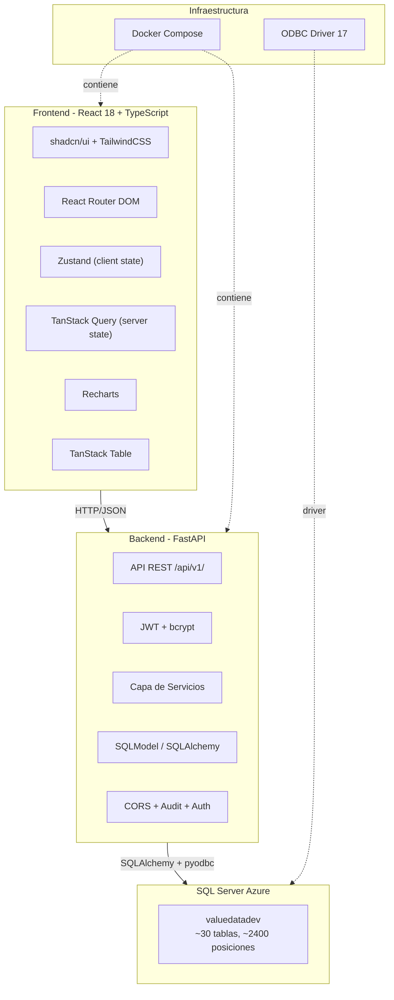
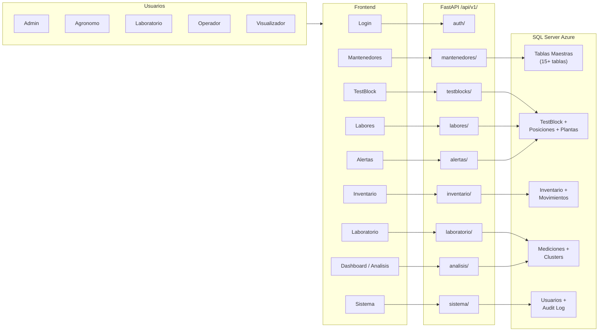
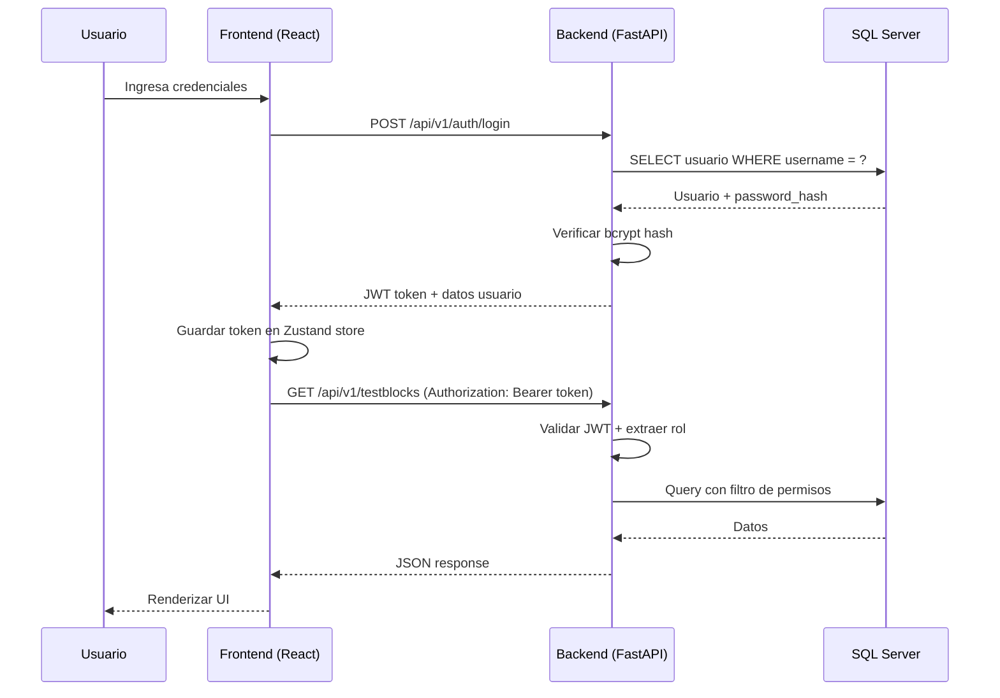

# Arquitectura del Sistema

## Sistema de Segmentacion de Nuevas Especies - Garces Fruit

**Version**: 3.4 (migrandose a React + FastAPI)
**Fecha**: 2026-03-20

---

## 1. Vision General

El sistema gestiona la evaluacion y segmentacion de nuevas variedades de especies frutales (carozos) para Garces Fruit. Permite administrar testblocks, inventario de vivero, mediciones de laboratorio, labores de campo, y analisis de calidad mediante clasificacion por clusters.

La arquitectura migra desde una aplicacion monolitica Streamlit hacia una arquitectura cliente-servidor desacoplada con React (frontend) y FastAPI (backend), manteniendo la base de datos SQL Server Azure existente.

---

## 2. Diagrama de Componentes

---

## 3. Diagrama de Flujo de Datos

---

## 4. Flujo de Autenticacion

---

## 5. Stack Tecnologico

### Frontend

| Tecnologia | Proposito |
|-----------|-----------|
| React 18 + TypeScript | Framework UI con tipado estatico |
| React Router DOM | Enrutamiento SPA |
| TanStack Query | Cache y sincronizacion de datos del servidor |
| Zustand | Estado global del cliente (auth, selecciones UI) |
| shadcn/ui + TailwindCSS | Componentes UI + utilidades CSS |
| Recharts | Graficos y visualizaciones |
| TanStack Table | Tablas de datos con sorting, filtros y paginacion |
| Lucide React | Iconografia |
| xlsx | Importacion/exportacion de archivos Excel |

### Backend

| Tecnologia | Proposito |
|-----------|-----------|
| FastAPI | Framework API REST de alto rendimiento |
| SQLModel | ORM compatible con Pydantic y SQLAlchemy |
| SQLAlchemy 2.0 | Motor de base de datos y connection pooling |
| pyodbc + ODBC Driver 17 | Driver de conexion a SQL Server |
| python-jose | Generacion y validacion de tokens JWT |
| bcrypt | Hashing de passwords |
| openpyxl | Procesamiento de archivos Excel |
| qrcode + Pillow | Generacion de codigos QR |
| reportlab | Generacion de PDFs |
| python-multipart | Manejo de uploads de archivos |

### Base de Datos

| Tecnologia | Proposito |
|-----------|-----------|
| SQL Server Azure | Base de datos relacional en la nube |
| Connection pool | 5 conexiones base + 10 overflow, reciclaje cada 1800s |

### Infraestructura

| Tecnologia | Proposito |
|-----------|-----------|
| Docker + Docker Compose | Containerizacion de servicios |
| Vite | Build tool para el frontend |

---

## 6. Justificacion del Stack

### Por que migrar de Streamlit a React + FastAPI?
- Streamlit limita la experiencia de usuario (no permite interfaces complejas como grillas interactivas de TestBlock)
- No soporta control granular de autenticacion y autorizacion por roles
- El modelo de ejecucion top-to-bottom de Streamlit causa re-renders innecesarios
- React permite una UX moderna con navegacion SPA fluida

### Por que mantener SQL Server Azure?
- La base de datos ya contiene datos de produccion (~2400 posiciones, ~2291 plantas)
- Migrar datos seria riesgoso y sin beneficio claro
- SQL Server Azure ya esta configurado y operativo

### Por que SQLModel?
- Compatible con Pydantic (validacion automatica en FastAPI)
- Compatible con SQLAlchemy (ORM maduro)
- Los modelos existentes del sistema Streamlit ya estan en SQLModel

### Por que Zustand + TanStack Query?
- Zustand: estado global minimalista (auth, selecciones UI) sin boilerplate
- TanStack Query: manejo de cache, invalidacion, refetch y estados de carga para datos del servidor

### Por que shadcn/ui?
- Componentes accesibles y personalizables (no una libreria cerrada)
- Basado en Radix UI con TailwindCSS
- Control total sobre el codigo fuente de cada componente

---

## 7. Principios de Diseno

1. **Separacion de responsabilidades**: Frontend maneja UI/UX, Backend maneja logica de negocio y acceso a datos
2. **API-first**: Toda la comunicacion entre frontend y backend es via API REST JSON
3. **Autenticacion centralizada**: JWT en cada request, validado en middleware
4. **Auditoria completa**: Todo cambio (INSERT/UPDATE/DELETE) se registra en `audit_log`
5. **Soft delete**: Las entidades se desactivan (`activo = 0`), no se eliminan fisicamente
6. **Reutilizacion**: Componentes genericos (CrudTable, CrudForm) para todas las entidades de mantenedores
