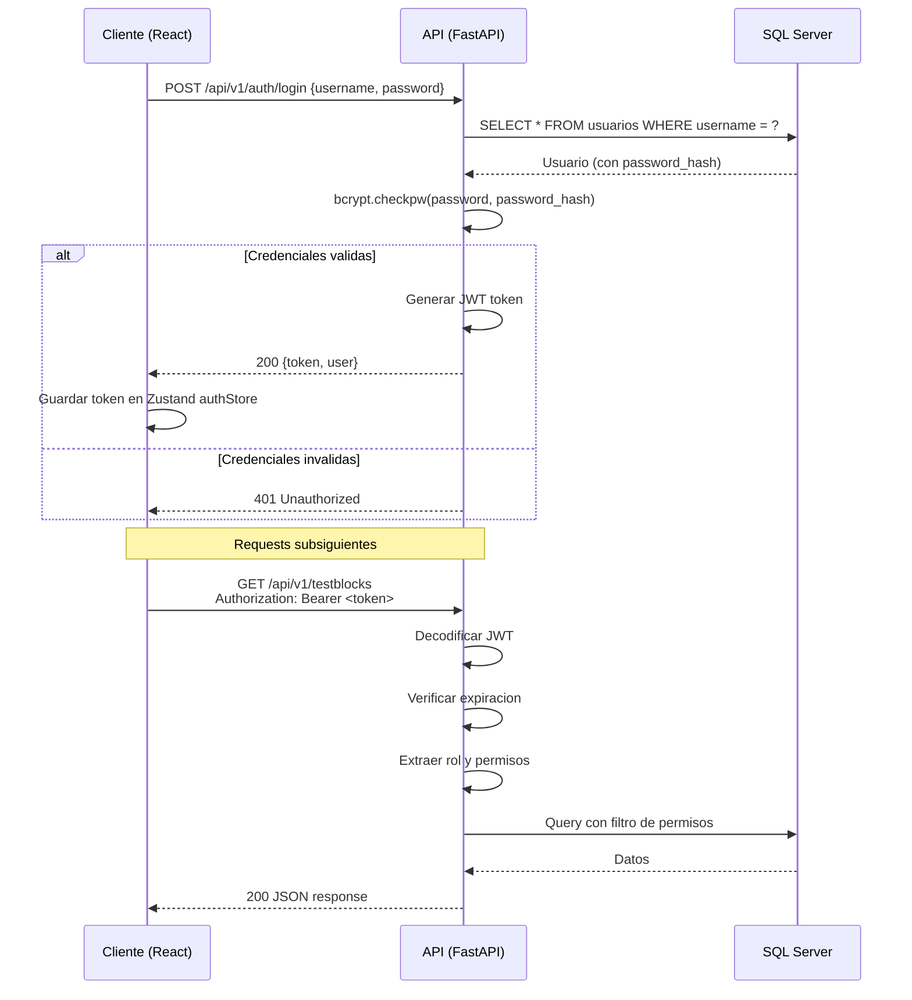
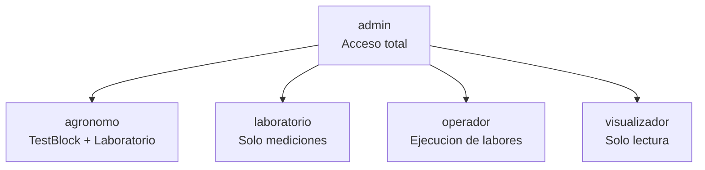

# Autenticacion y Autorizacion

## Sistema de Segmentacion de Nuevas Especies - Garces Fruit

---

## 1. Flujo de Autenticacion



---

## 2. Estructura del Token JWT

### Header
```json
{
  "alg": "HS256",
  "typ": "JWT"
}
```

### Payload (Claims)
```json
{
  "sub": "admin",
  "user_id": 1,
  "nombre": "Administrador",
  "rol": "admin",
  "campos": [1, 2, 3],
  "exp": 1737460800,
  "iat": 1737432000
}
```

| Claim | Tipo | Descripcion |
|-------|------|-------------|
| `sub` | string | Username del usuario (subject) |
| `user_id` | int | ID del usuario en la base de datos |
| `nombre` | string | Nombre completo para mostrar en UI |
| `rol` | string | Rol del usuario (admin, agronomo, etc.) |
| `campos` | int[] | IDs de campos a los que tiene acceso |
| `exp` | int | Timestamp de expiracion (UTC) |
| `iat` | int | Timestamp de emision (UTC) |

### Configuracion
- **Algoritmo**: HS256
- **Expiracion**: 480 minutos (8 horas, una jornada laboral)
- **Secret key**: Variable de entorno `JWT_SECRET_KEY`

---

## 3. Hashing de Passwords

Se usa **bcrypt** para el hashing de contrasenas.

### Proceso de registro
```python
import bcrypt

password = "mi_password_seguro"
salt = bcrypt.gensalt(rounds=12)
password_hash = bcrypt.hashpw(password.encode('utf-8'), salt)
# Almacenar password_hash en usuarios.password_hash
```

### Proceso de verificacion
```python
password_input = "mi_password_seguro"
stored_hash = usuario.password_hash
is_valid = bcrypt.checkpw(password_input.encode('utf-8'), stored_hash.encode('utf-8'))
```

### Caracteristicas de bcrypt
- **Salt automatico**: Cada hash incluye un salt unico
- **Cost factor**: 12 rounds (configurable)
- **Resistente a ataques de fuerza bruta**: Deliberadamente lento

---

## 4. Roles del Sistema

### Definicion de Roles



| Rol | Descripcion |
|-----|-------------|
| `admin` | Acceso total al sistema. Gestiona usuarios, roles, configuracion y todos los modulos |
| `agronomo` | Gestiona testblocks, inventario, laboratorio, labores y analisis. No gestiona usuarios ni configuracion del sistema |
| `laboratorio` | Registra mediciones de laboratorio y consulta resultados de calidad. No gestiona testblocks ni inventario |
| `operador` | Ejecuta labores de campo y registra fenologia. Acceso operativo limitado |
| `visualizador` | Solo lectura en todos los modulos. No puede crear, modificar ni eliminar datos |

---

## 5. Matriz de Permisos por Rol

### Modulo Auth
| Operacion | admin | agronomo | laboratorio | operador | visualizador |
|-----------|:-----:|:--------:|:-----------:|:--------:|:------------:|
| Login | SI | SI | SI | SI | SI |
| Ver perfil propio | SI | SI | SI | SI | SI |
| Cambiar password propio | SI | SI | SI | SI | SI |

### Modulo Mantenedores
| Operacion | admin | agronomo | laboratorio | operador | visualizador |
|-----------|:-----:|:--------:|:-----------:|:--------:|:------------:|
| Listar entidades | SI | SI | SI | SI | SI |
| Crear/Editar entidades | SI | SI | NO | NO | NO |
| Eliminar entidades | SI | NO | NO | NO | NO |
| Importar Excel | SI | SI | NO | NO | NO |

### Modulo Inventario
| Operacion | admin | agronomo | laboratorio | operador | visualizador |
|-----------|:-----:|:--------:|:-----------:|:--------:|:------------:|
| Ver inventario | SI | SI | SI | SI | SI |
| Crear lotes | SI | SI | NO | NO | NO |
| Registrar movimientos | SI | SI | NO | NO | NO |
| Crear despachos | SI | SI | NO | NO | NO |

### Modulo TestBlock
| Operacion | admin | agronomo | laboratorio | operador | visualizador |
|-----------|:-----:|:--------:|:-----------:|:--------:|:------------:|
| Ver testblocks y grilla | SI | SI | SI | SI | SI |
| Crear/Editar testblock | SI | SI | NO | NO | NO |
| Alta/Baja de plantas | SI | SI | NO | NO | NO |
| Alta/Baja masiva | SI | SI | NO | NO | NO |
| Generar posiciones | SI | SI | NO | NO | NO |
| Generar QR | SI | SI | SI | SI | SI |

### Modulo Laboratorio
| Operacion | admin | agronomo | laboratorio | operador | visualizador |
|-----------|:-----:|:--------:|:-----------:|:--------:|:------------:|
| Ver mediciones | SI | SI | SI | SI | SI |
| Registrar mediciones | SI | SI | SI | NO | NO |
| Importar mediciones Excel | SI | SI | SI | NO | NO |
| Ver KPIs | SI | SI | SI | SI | SI |

### Modulo Labores
| Operacion | admin | agronomo | laboratorio | operador | visualizador |
|-----------|:-----:|:--------:|:-----------:|:--------:|:------------:|
| Ver planificacion | SI | SI | SI | SI | SI |
| Crear planificacion | SI | SI | NO | NO | NO |
| Ejecutar labores | SI | SI | NO | SI | NO |
| Ver ordenes de trabajo | SI | SI | SI | SI | SI |

### Modulo Analisis
| Operacion | admin | agronomo | laboratorio | operador | visualizador |
|-----------|:-----:|:--------:|:-----------:|:--------:|:------------:|
| Ver dashboard | SI | SI | SI | SI | SI |
| Ver paquetes tecnologicos | SI | SI | SI | SI | SI |
| Ver clusters | SI | SI | SI | SI | SI |

### Modulo Alertas
| Operacion | admin | agronomo | laboratorio | operador | visualizador |
|-----------|:-----:|:--------:|:-----------:|:--------:|:------------:|
| Ver alertas | SI | SI | SI | SI | SI |
| Resolver alertas | SI | SI | NO | NO | NO |
| Configurar reglas | SI | NO | NO | NO | NO |

### Modulo Sistema
| Operacion | admin | agronomo | laboratorio | operador | visualizador |
|-----------|:-----:|:--------:|:-----------:|:--------:|:------------:|
| Gestionar usuarios | SI | NO | NO | NO | NO |
| Gestionar roles | SI | NO | NO | NO | NO |
| Ver audit log | SI | NO | NO | NO | NO |
| Gestionar catalogos | SI | NO | NO | NO | NO |

---

## 6. Filtro por Campos Asignados

Cada usuario tiene un campo `campos_asignados` (comma-separated IDs) que restringe su acceso a datos de campos especificos.

```
campos_asignados = "1,2"  → Solo ve datos de Campo 1 y Campo 2
campos_asignados = "1,2,3" → Ve todos los campos (admin tipicamente)
campos_asignados = null/vacio → Sin restriccion (solo admin)
```

Este filtro se aplica automaticamente en el middleware de autorizacion para todas las queries que involucren testblocks, posiciones, inventario, mediciones y labores.

---

## 7. Flujo en el Frontend

### Zustand Auth Store
```typescript
interface AuthState {
  user: User | null;
  token: string | null;
  login(username: string, password: string): Promise<void>;
  logout(): void;
}
```

### Interceptor HTTP
Todas las llamadas API incluyen automaticamente el token:
```typescript
// services/api.ts
const headers = {
  'Authorization': `Bearer ${authStore.getState().token}`,
  'Content-Type': 'application/json'
};
```

### Proteccion de Rutas
Las rutas del frontend estan protegidas por un componente `ProtectedRoute` que:
1. Verifica que exista un token valido
2. Verifica que el rol del usuario tenga acceso a la ruta
3. Redirige a `/login` si no esta autenticado
4. Muestra error 403 si no tiene permisos

### Renovacion de Token
- El token expira tras 8 horas de inactividad
- Si el backend responde `401`, el frontend redirige automaticamente al login
- No se implementa refresh token en el MVP
