# Base de Datos

## Sistema de Segmentacion de Nuevas Especies - Garces Fruit

**Motor**: SQL Server Azure
**Servidor**: tcp:valuedata.database.windows.net,1433
**Driver**: ODBC Driver 17 for SQL Server
**Connection Pool**: 5 base + 10 overflow, reciclaje cada 1800s

---

## 1. Diagrama Entidad-Relacion

```mermaid
erDiagram
    %% === MAESTRAS ===
    paises {
        int id_pais PK
        varchar codigo UK
        nvarchar nombre
        bit activo
    }

    campos {
        int id_campo PK
        varchar codigo UK
        nvarchar nombre
        decimal hectareas
        decimal latitud
        decimal longitud
        bit activo
    }

    cuarteles {
        int id_cuartel PK
        int id_campo FK
        varchar codigo
        nvarchar nombre
        bit activo
    }

    especies {
        int id_especie PK
        varchar codigo UK
        nvarchar nombre
        nvarchar nombre_cientifico
        nvarchar emoji
        varchar color_hex
        bit activo
    }

    portainjertos {
        int id_portainjerto PK
        varchar codigo UK
        nvarchar nombre
        nvarchar vigor
        nvarchar compatibilidad
        bit activo
    }

    pmg {
        int id_pmg PK
        varchar codigo UK
        nvarchar nombre
        nvarchar licenciante
        nvarchar pais_origen
        bit activo
    }

    origenes {
        int id_origen PK
        varchar codigo UK
        nvarchar nombre
        nvarchar pais
        nvarchar tipo
        bit activo
    }

    viveros {
        int id_vivero PK
        varchar codigo UK
        nvarchar nombre
        int id_pmg FK
        bit activo
    }

    colores {
        int id_color PK
        varchar codigo
        nvarchar nombre
        varchar tipo
        nvarchar aplica_especie
        bit activo
    }

    susceptibilidades {
        int id_suscept PK
        varchar codigo UK
        nvarchar nombre
        nvarchar categoria
        nvarchar severidad
        bit activo
    }

    variedades {
        int id_variedad PK
        int id_especie FK
        int id_pmg FK
        int id_origen FK
        varchar codigo UK
        nvarchar nombre
        nvarchar estado
        int id_color_fruto FK
        int id_color_pulpa FK
        int id_color_cubrimiento FK
        bit activo
    }

    variedad_susceptibilidades {
        int id_vs PK
        int id_variedad FK
        int id_suscept FK
        nvarchar nivel
    }

    pmg_especies {
        int id_pmg_especie PK
        int id_pmg FK
        int id_especie FK
    }

    tipos_labor {
        int id_labor PK
        varchar codigo UK
        nvarchar categoria
        nvarchar nombre
        bit activo
    }

    estados_fenologicos {
        int id_estado PK
        int id_especie FK
        varchar codigo
        nvarchar nombre
        int orden
    }

    estados_planta {
        int id_estado PK
        varchar codigo UK
        nvarchar nombre
        bit es_final
        bit activo
    }

    temporadas {
        int id_temporada PK
        varchar codigo UK
        nvarchar nombre
        date fecha_inicio
        date fecha_fin
        nvarchar estado
    }

    bodegas {
        int id_bodega PK
        varchar codigo
        nvarchar nombre
        nvarchar ubicacion
        bit activo
    }

    catalogos {
        int id PK
        varchar tipo
        nvarchar valor
        int orden
    }

    correlativos {
        int id PK
        varchar tipo UK
        varchar prefijo
        int ultimo_numero
    }

    %% === TESTBLOCK E INFRAESTRUCTURA ===
    centros_costo {
        int id PK
        varchar codigo UK
        nvarchar nombre
        int id_campo FK
        decimal presupuesto
        bit activo
    }

    marcos_plantacion {
        int id PK
        varchar codigo UK
        nvarchar nombre
        decimal dist_entre_hileras
        decimal dist_entre_plantas
        int plantas_hectarea
        bit activo
    }

    testblocks {
        int id_testblock PK
        varchar codigo UK
        nvarchar nombre
        int id_campo FK
        int id_centro_costo FK
        int id_cuartel FK
        int id_marco FK
        int num_hileras
        int total_posiciones
        varchar estado
        bit activo
    }

    testblock_hileras {
        int id_hilera PK
        int id_cuartel FK
        int numero_hilera
        int total_posiciones
        int portainjerto_default_id FK
    }

    %% === INVENTARIO Y PLANTAS ===
    inventario_vivero {
        int id_inventario PK
        varchar codigo_lote UK
        int id_variedad FK
        int id_portainjerto FK
        int id_vivero FK
        int id_especie FK
        int id_bodega FK
        int cantidad_inicial
        int cantidad_actual
        varchar estado
    }

    movimientos_inventario {
        int id_movimiento PK
        int id_inventario FK
        int id_planta FK
        varchar tipo
        int cantidad
        int saldo_anterior
        int saldo_nuevo
    }

    posiciones_testblock {
        int id_posicion PK
        varchar codigo_unico UK
        int id_cuartel FK
        int id_testblock FK
        int id_variedad FK
        int id_portainjerto FK
        int id_lote FK
        int hilera
        int posicion
        varchar estado
        bit protegida
    }

    plantas {
        int id_planta PK
        varchar codigo UK
        int id_posicion FK
        int id_variedad FK
        int id_portainjerto FK
        int id_especie FK
        int id_lote_origen FK
        varchar condicion
        bit activa
    }

    inventario_testblock {
        int id_inventario_tb PK
        int id_inventario FK
        int id_cuartel FK
        int cantidad_asignada
        int cantidad_plantada
        varchar estado
    }

    guias_despacho {
        int id_guia PK
        varchar numero_guia
        int id_bodega_origen FK
        int id_testblock_destino FK
        varchar estado
        int total_plantas
    }

    historial_posiciones {
        int id_historial PK
        int id_posicion FK
        int id_planta FK
        varchar accion
        varchar estado_anterior
        varchar estado_nuevo
        nvarchar motivo
    }

    %% === LABORATORIO Y CALIDAD ===
    mediciones_laboratorio {
        int id_medicion PK
        int id_posicion FK
        int id_planta FK
        varchar temporada
        date fecha_medicion
        decimal brix
        decimal acidez
        decimal firmeza
        decimal calibre
        decimal peso
        int color_pct
        int cracking_pct
    }

    clasificacion_cluster {
        int id_clasificacion PK
        int id_medicion FK
        int cluster
        decimal score_total
        varchar metodo
    }

    umbrales_calidad {
        int id_umbral PK
        int id_especie FK
        varchar metrica
        int banda
        decimal valor_min
        decimal valor_max
    }

    registros_fenologicos {
        int id_registro PK
        int id_posicion FK
        int id_planta FK
        int id_estado_fenol FK
        varchar temporada
        date fecha_registro
    }

    ejecucion_labores {
        int id_ejecucion PK
        int id_posicion FK
        int id_planta FK
        int id_labor FK
        varchar temporada
        date fecha_ejecucion
        varchar estado
    }

    %% === ANALISIS Y ALERTAS ===
    paquete_tecnologico {
        int id_paquete PK
        int id_variedad FK
        varchar temporada
        int cluster_predominante
        decimal score_promedio
        nvarchar decision
    }

    alertas {
        int id_alerta PK
        int id_posicion FK
        varchar tipo_alerta
        varchar prioridad
        nvarchar titulo
        varchar estado
    }

    reglas_alerta {
        int id_regla PK
        varchar codigo UK
        nvarchar nombre
        varchar tipo
        nvarchar condicion
        bit activo
    }

    %% === SISTEMA ===
    usuarios {
        int id_usuario PK
        varchar username UK
        nvarchar nombre_completo
        varchar password_hash
        varchar rol
        bit activo
    }

    roles {
        int id_rol PK
        varchar nombre UK
        nvarchar permisos
        bit activo
    }

    audit_log {
        int id_log PK
        varchar tabla
        int registro_id
        varchar accion
        nvarchar datos_anteriores
        nvarchar datos_nuevos
        nvarchar usuario
        datetime fecha
    }

    %% === RELACIONES ===
    campos ||--o{ cuarteles : "tiene"
    campos ||--o{ testblocks : "tiene"
    campos ||--o{ centros_costo : "tiene"
    cuarteles ||--o{ testblocks : "pertenece"
    cuarteles ||--o{ posiciones_testblock : "contiene"
    cuarteles ||--o{ testblock_hileras : "tiene"
    cuarteles ||--o{ inventario_testblock : "destino"

    testblocks ||--o{ posiciones_testblock : "tiene"
    testblocks }o--|| marcos_plantacion : "usa"
    testblocks }o--|| centros_costo : "asignado"

    posiciones_testblock ||--o| plantas : "contiene"
    posiciones_testblock }o--o| variedades : "plantada"
    posiciones_testblock }o--o| portainjertos : "usa"
    posiciones_testblock }o--o| inventario_vivero : "lote"
    posiciones_testblock ||--o{ historial_posiciones : "historial"
    posiciones_testblock ||--o{ mediciones_laboratorio : "medido"
    posiciones_testblock ||--o{ registros_fenologicos : "registro"
    posiciones_testblock ||--o{ ejecucion_labores : "labor"
    posiciones_testblock ||--o{ alertas : "alerta"

    plantas }o--|| variedades : "es"
    plantas }o--o| portainjertos : "sobre"
    plantas }o--o| especies : "de"
    plantas }o--o| inventario_vivero : "lote origen"
    plantas ||--o{ mediciones_laboratorio : "medida"
    plantas ||--o{ registros_fenologicos : "fenologia"
    plantas ||--o{ ejecucion_labores : "labor"
    plantas ||--o{ historial_posiciones : "historial"
    plantas ||--o{ movimientos_inventario : "movimiento"

    especies ||--o{ variedades : "tiene"
    especies ||--o{ estados_fenologicos : "estados"
    especies ||--o{ umbrales_calidad : "umbrales"

    variedades }o--|| especies : "de"
    variedades }o--o| pmg : "programa"
    variedades }o--o| origenes : "origen"
    variedades }o--o| colores : "color fruto"
    variedades }o--o| colores : "color pulpa"
    variedades }o--o| colores : "color cubrimiento"
    variedades ||--o{ variedad_susceptibilidades : "tiene"
    variedades ||--o{ paquete_tecnologico : "evaluada"
    variedades ||--o{ inventario_vivero : "en lotes"

    susceptibilidades ||--o{ variedad_susceptibilidades : "afecta"

    pmg ||--o{ pmg_especies : "trabaja"
    pmg ||--o{ viveros : "tiene"
    especies ||--o{ pmg_especies : "en programas"

    viveros }o--o| pmg : "de"

    inventario_vivero }o--|| variedades : "variedad"
    inventario_vivero }o--o| portainjertos : "portainjerto"
    inventario_vivero }o--o| viveros : "vivero"
    inventario_vivero }o--o| especies : "especie"
    inventario_vivero }o--o| bodegas : "bodega"
    inventario_vivero ||--o{ movimientos_inventario : "movimientos"
    inventario_vivero ||--o{ inventario_testblock : "despachos"

    mediciones_laboratorio ||--o| clasificacion_cluster : "clasificada"

    ejecucion_labores }o--|| tipos_labor : "tipo"
    registros_fenologicos }o--|| estados_fenologicos : "estado"

    guias_despacho }o--|| bodegas : "origen"
    guias_despacho }o--|| testblocks : "destino"

    testblock_hileras }o--o| portainjertos : "default PI"
```

---

## 2. Tablas por Dominio

### 2.1 Tablas Maestras (15 tablas)

Tablas de configuracion y catalogo que definen las entidades base del sistema.

| Tabla | PK | Descripcion | Registros aprox. |
|-------|----|-----------  |-----------------|
| `paises` | id_pais | Paises (ISO 3-letter) | ~5 |
| `campos` | id_campo | Ubicaciones fisicas (predios) con coordenadas GPS | ~3 |
| `cuarteles` | id_cuartel | Subdivisiones dentro de un campo | ~10 |
| `especies` | id_especie | Especies frutales evaluadas | 7 |
| `portainjertos` | id_portainjerto | Portainjertos disponibles con datos de vigor y compatibilidad | ~10 |
| `pmg` | id_pmg | Programas de Mejoramiento Genetico (licenciantes) | ~10 |
| `pmg_especies` | id_pmg_especie | Relacion N:M entre PMG y Especies | ~15 |
| `origenes` | id_origen | Origenes/licenciantes de variedades | ~10 |
| `viveros` | id_vivero | Viveros proveedores de plantas | ~5 |
| `colores` | id_color | Colores de fruto, pulpa y cubrimiento por especie | ~30 |
| `susceptibilidades` | id_suscept | Enfermedades y problemas fitosanitarios | ~20 |
| `variedades` | id_variedad | Variedades frutales con datos comerciales y agronomicos. Tabla central del sistema | 65+ |
| `variedad_susceptibilidades` | id_vs | Relacion N:M entre Variedades y Susceptibilidades con nivel de severidad | ~100 |
| `tipos_labor` | id_labor | Tipos de labores de campo (poda, raleo, cosecha, etc.) | ~15 |
| `estados_fenologicos` | id_estado | Estados fenologicos por especie (dormancia, floracion, etc.) | ~40 |
| `estados_planta` | id_estado | Estados posibles de una planta (viva, muerta, etc.) | ~8 |
| `temporadas` | id_temporada | Temporadas agricolas (ej: 2024-2025) | ~3 |
| `bodegas` | id_bodega | Bodegas de almacenamiento de plantas | ~3 |
| `catalogos` | id | Tabla generica de valores de catalogo (epoca_cosecha, vigor, etc.) | ~50 |
| `correlativos` | id | Control de numeracion secuencial (guias de despacho, etc.) | ~5 |

### 2.2 TestBlock e Infraestructura (4 tablas)

Definen la estructura fisica de los testblocks donde se evaluan las variedades.

| Tabla | PK | Descripcion |
|-------|----|-------------|
| `centros_costo` | id | Centros de costo asociados a campos. **Nota**: PK es `id`, no `id_centro` |
| `marcos_plantacion` | id | Marcos de plantacion (distancias, sistema de conduccion, plantas/ha). **Nota**: PK es `id`, no `id_marco` |
| `testblocks` | id_testblock | Bloques de testeo: area fisica donde se plantan y evaluan variedades. Vinculado a campo, cuartel, centro de costo y marco de plantacion |
| `testblock_hileras` | id_hilera | Hileras dentro de un testblock con portainjerto por defecto |

### 2.3 Inventario y Plantas (7 tablas)

Gestionan el stock de plantas y su trazabilidad desde vivero hasta testblock.

| Tabla | PK | Descripcion |
|-------|----|-------------|
| `inventario_vivero` | id_inventario | Lotes de plantas con stock (cantidad_inicial, cantidad_actual). Estados: disponible, comprometido, agotado, baja |
| `movimientos_inventario` | id_movimiento | Kardex de movimientos: ingreso, retiro, ajuste_positivo, ajuste_negativo, envio_testblock |
| `posiciones_testblock` | id_posicion | Cada posicion fisica en la grilla del testblock (CUARTEL-H01-P01). Estados: vacia, alta, baja, replante |
| `plantas` | id_planta | Planta individual con trazabilidad completa. Condiciones: EN_EVALUACION, BUENA, REGULAR, MALA, MUERTA, DESCARTADA |
| `inventario_testblock` | id_inventario_tb | Despachos de inventario hacia testblocks |
| `guias_despacho` | id_guia | Guias de despacho con correlativo GD-00001 |
| `historial_posiciones` | id_historial | Audit trail de cambios en posiciones (alta, baja, replante, masivas) |

### 2.4 Laboratorio y Calidad (5 tablas)

Registros de mediciones de calidad y clasificacion por clusters.

| Tabla | PK | Descripcion |
|-------|----|-------------|
| `mediciones_laboratorio` | id_medicion | Mediciones de calidad: brix, acidez, firmeza, calibre, peso, color_pct, cracking_pct |
| `clasificacion_cluster` | id_clasificacion | Clasificacion automatica en clusters 1-5 (5=mejor) por umbrales o k-means |
| `umbrales_calidad` | id_umbral | Rangos de calidad por especie y metrica (brix, firmeza, acidez, calibre) en 5 bandas |
| `registros_fenologicos` | id_registro | Observaciones fenologicas por planta/posicion con porcentaje de avance |
| `ejecucion_labores` | id_ejecucion | Registro de labores ejecutadas (poda, raleo, cosecha, etc.) |

### 2.5 Analisis y Alertas (3 tablas)

Analisis agregado por variedad y sistema de alertas.

| Tabla | PK | Descripcion |
|-------|----|-------------|
| `paquete_tecnologico` | id_paquete | Resumen de evaluacion por variedad y temporada: promedios, cluster predominante, decision (plantar/descartar/reevaluar) |
| `alertas` | id_alerta | Alertas activas del sistema (calidad fuera de rango, stock bajo, etc.). Prioridades: baja, media, alta, critica |
| `reglas_alerta` | id_regla | Reglas configurables para generacion automatica de alertas |

### 2.6 Sistema (3 tablas)

Autenticacion, autorizacion y auditoria.

| Tabla | PK | Descripcion |
|-------|----|-------------|
| `usuarios` | id_usuario | Usuarios del sistema con password bcrypt y rol asignado |
| `roles` | id_rol | Definicion de roles con permisos en formato JSON |
| `audit_log` | id_log | Log de auditoria: toda operacion INSERT/UPDATE/DELETE con datos antes/despues en JSON |

---

## 3. Relaciones Clave

### Campo → TestBlock → Posicion → Planta
La jerarquia principal del sistema. Un campo tiene cuarteles y testblocks. Cada testblock tiene una grilla de posiciones organizadas por hilera y posicion. Cada posicion puede contener una planta activa.

### Variedad como Entidad Central
`variedades` es la tabla mas conectada: referenciada por posiciones, plantas, inventario, mediciones y paquetes tecnologicos. Cada variedad pertenece a una especie, un PMG y un origen.

### Trazabilidad de Inventario
`inventario_vivero` → `movimientos_inventario` registra todo movimiento. Al plantar, se crea un `movimiento` tipo `envio_testblock` y se descuenta `cantidad_actual`.

### Medicion → Cluster
Cada medicion de laboratorio genera automaticamente una clasificacion en `clasificacion_cluster` usando los umbrales definidos en `umbrales_calidad` por especie.

---

## 4. Indices y Constraints Importantes

### Claves Unicas (UNIQUE)
- `posiciones_testblock(id_cuartel, hilera, posicion)` — No puede haber dos posiciones iguales
- `posiciones_testblock(codigo_unico)` — Formato CUARTEL-H01-P01
- `umbrales_calidad(id_especie, metrica, banda)` — Un umbral por especie/metrica/banda
- `paquete_tecnologico(id_variedad, temporada)` — Un paquete por variedad/temporada
- `variedad_susceptibilidades(id_variedad, id_suscept)` — Sin duplicados
- `pmg_especies(id_pmg, id_especie)` — Sin duplicados
- `colores(codigo, tipo)` — Codigo unico por tipo

### Campos con CHECK Constraints
- `movimientos_inventario.tipo` IN ('ingreso', 'retiro', 'ajuste_positivo', 'ajuste_negativo', 'envio_testblock')
- `posiciones_testblock.estado` IN ('vacia', 'alta', 'baja', 'replante')
- `plantas.condicion` IN ('EN_EVALUACION', 'BUENA', 'REGULAR', 'MALA', 'MUERTA', 'DESCARTADA')

### Campos por Defecto
- Todas las tablas con `activo BIT DEFAULT 1`
- Todas las tablas con `fecha_creacion DATETIME DEFAULT GETDATE()`
- Soft delete via `activo = 0` (no se eliminan registros fisicamente)

---

## 5. Volumetria Actual

| Tabla | Registros aproximados |
|-------|-----------------------|
| posiciones_testblock | ~2,400 |
| plantas (activas) | ~2,291 |
| variedades | ~65 |
| inventario_vivero | ~75 lotes |
| portainjertos | ~10 |
| especies | 7 |
| testblocks (activos) | 3 |
| campos | ~3 |
| usuarios | ~5 |
| mediciones_laboratorio | En crecimiento |

Las especies evaluadas son: Cerezo, Ciruela, Durazno, Nectarina, Paraguayo, Platerina, Damasco Test.

Los portainjertos disponibles son: Maxma 60, Maxma 14, Colt, Gisela 6, Gisela 12, Atlas, Nemaguard, Mariana 2624, Garnem.
